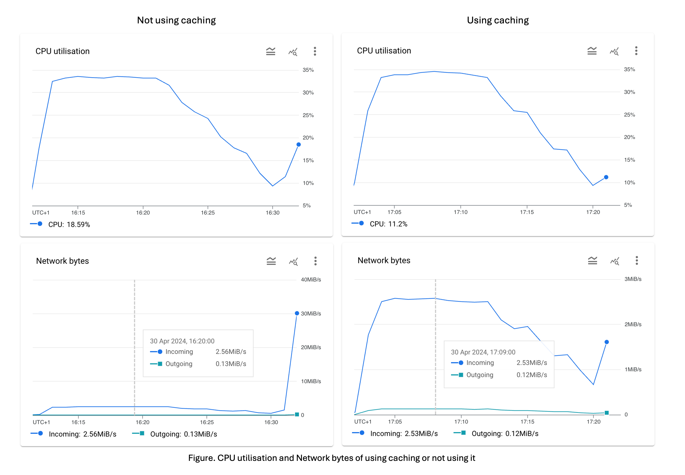
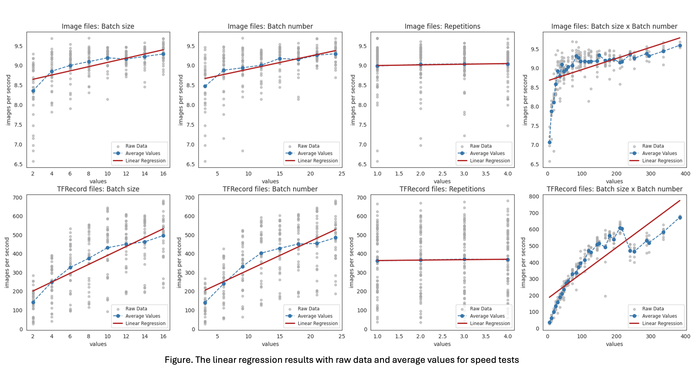

## 🧪 Performance Verification and Statistical Analysis

This document provides the technical details, empirical evidence, and statistical analysis supporting the project's core performance claims, proving the **40× structural advantage** achieved by the optimised data format.

***

### 1. ⚡️ Performance Testing Mechanism & Data Integrity

The speed test was parallelised using a dedicated Spark Job to directly contrast the read throughput of the optimised TFRecord format against raw image files.

#### A. Cache Strategy (`RDD.cache()`) Impact

To isolate true I/O speed and prevent redundant computations, **`RDD.cache()`** was strategically applied to repeatedly used RDDs (such as parameter combinations and raw data results).

| Metric | Baseline (Without Caching) | Optimised Gain | Core Impact |
| :--- | :--- | :--- | :--- |
| **CPU Utilization** | Increases by ∼10% | **Slight increase** | Prevents unnecessary re-computation load. |
| **Network I/O (Spike)** | Spikes significantly 30 MiB/s | **Almost eliminated** | Eliminates redundant network I/O overhead. |
| **Overall Execution Time** | Slower | **2% faster** | Confirms efficiency gain and results integrity. |

***

### 2. 📈 Statistical Proof: OLS Regression Analysis (40× Advantage)

The project's core performance claim is validated using **OLS (Ordinary Least Squares) Linear Regression Analysis** on the distributed speed test data.

#### A. Regression Results (Summary)

| Metric | Raw Files (Baseline) | TFRecord (Optimised) | Performance Conclusion |
| :--- | :--- | :--- | :--- |
| **Intrinsic Read Throughput (IPS)** | $\approx$ **9 IPS** | $\approx$ **360 IPS** | **40× Structural Gain**: Resolves I/O latency bottleneck. |
| **Batch Size Responsiveness (Coefficient)** | **0.054** | **23.671** | **438× Tuning Leverage**: Enables efficient parallel processing. |

#### B. Detailed OLS Data Table

This table presents the full OLS analysis results, where P-values less than 0.0001 are represented as `<.0001` to denote high statistical significance.

| Case | Parameter | Intercept (IPS) | Coefficient | P-value |
| :--- | :--- | ---: | ---: | ---: |
| **Image Files** | Batch size | 8.536 | 0.054 | <.0001 |
| **Image Files** | Batch number | 8.564 | 0.034 | <.0001 |
| **Image Files** | Repetitions | **8.977** | 0.017 | 0.541 |
| **Image Files** | Batch size x Batch number | 8.663 | 0.003 | <.0001 |
| **TFRecord Files** | Batch size | 152.878 | **23.671** | <.0001 |
| **TFRecord Files** | Batch number | 158.615 | 15.355 | <.0001 |
| **TFRecord Files** | Repetitions | **360.272** | 2.256 | 0.812 |
| **TFRecord Files** | Batch size x Batch number | 177.532 | 1.550 | <.0001 |

#### C. Visual and Analytical Discussion

* **Visual Evidence:** **Figure 4** displays the individual output values, average values, and the derived regression lines for each parameter. The visual separation between the Raw Files and **TFRecord** regression lines clearly illustrates the **40× throughput disparity**.

* **Latency Context:** The **40× speed difference** aligns with known cloud latency figures, underscoring the necessity of prioritising optimised storage and retrieval in large-scale ML applications.

* **Cloud Bottlenecks & Limitations:**
    * The observation that average values fall **below the regression line** at higher batch size/number values suggests that the linearity assumption breaks down due to **cloud server-side restrictions** (e.g., bucket I/O capacity limits or load redistribution time).
    * While linear modelling is practical, future work should consider **polynomial regression** or **multiple linear regression with combined factors** to explore non-linear relationships and complex parameter interactions.

---
[⬅ Back to Project Overview](../README.md)
