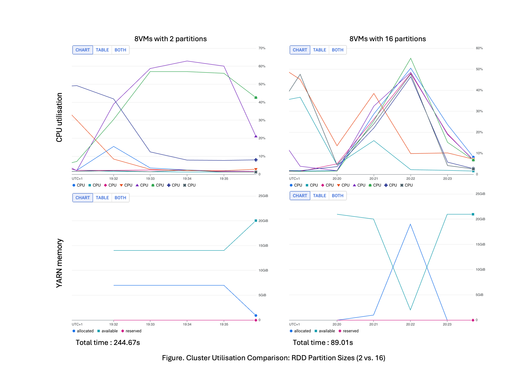
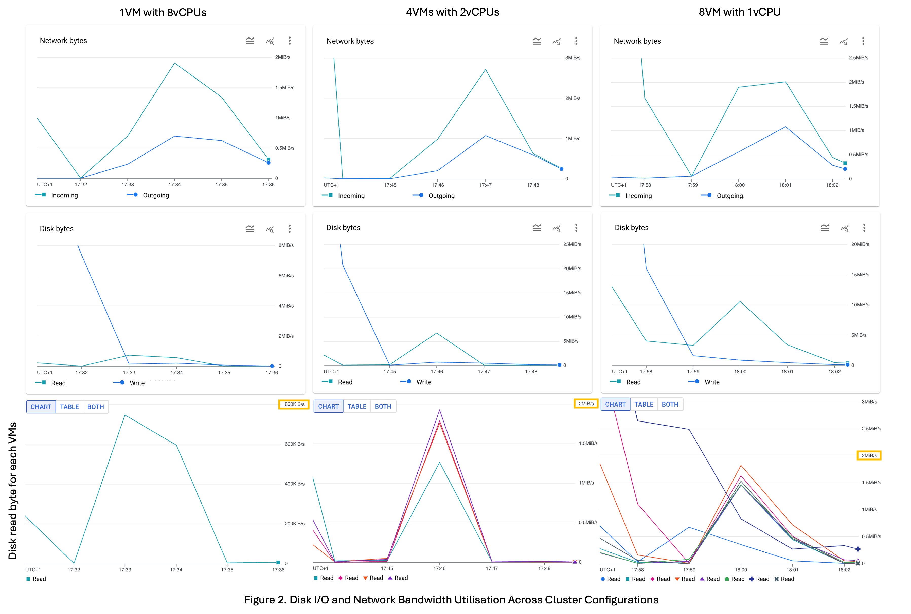

## ⚙️ RDD & Cloud Resource Optimisation Details

This document provides the detailed technical rationale and empirical evidence supporting the architectural decisions made in the project, specifically demonstrating how internal parallelism tuning and cloud resource configuration jointly achieved the 64% processing time reduction and shifted the pipeline bottleneck.

---

### 🧠 Maximise Internal Parallelism (RDD Tuning Analysis)

The primary bottleneck was the limited parallelism of the default Spark configuration. This experiment demonstrates the direct impact of RDD Partitioning on cluster efficiency and processing time.

#### Experiment: 2 Partitions vs. 16 Partitions

| Configuration | RDD Partitions | Effective Machines Used | Cluster Utilisation | Total Processing Time |
| :---: | :---: | :---: | :---: | :---: |
| **Baseline** | **2** | Only 2 out of 8 | Limited / Low | **244 seconds** |
| **Optimized** | **16** | **All 8 machines** | Maximized / Efficient | **89 seconds** |

#### Key Findings

* **Utilisation Proof:** The default 2 partitions restricted processing to only 2 machines. Increasing to **16 partitions** allowed **all 8 machines to be fully utilised**, validating the need to match parallelism with available cores.
* **Performance Gain:** This strategic tuning alone **reduced total processing time from 244 seconds to 89 seconds** (a **≈64% time reduction**), which constitutes the project's core performance achievement.
* **Visual Evidence:** Both CPU and memory metrics confirmed the shift:
    * **CPU Utilisation:** The Figure below demonstrates a near-flat CPU line for 2 partitions, spiking drastically for 16 partitions, confirming full resource engagement.
    * **Memory Efficiency:** Higher partitions resulted in more efficient **YARN memory utilisation** and overall resource allocation across the cluster.

---

### ☁️ Cloud Configuration Strategy Experimentation

After locking in the optimal software parallelism (16 RDD Partitions), the focus shifted to selecting the cloud infrastructure that could sustain this high parallelism with minimal I/O latency.  
This section details the comparative testing across three distinct cluster configurations to understand the relationship between VM count, resource allocation, and core performance metrics (Disk I/O and Network Bandwidth).

#### Experiment Setup

Three configurations, all totaling **8 vCPUs**, were tested:
1.  **Single VM:** 1 VM with 8 vCPUs
2.  **Mid-Scale:** 4 VMs with 2 vCPUs each
3.  **Max-Scale:** 8 VMs with 1 vCPU each

#### Key Findings on Resource Utilisation

**A. Network Bandwidth (Total Usage)**

  * **Observation:** The **total network bandwidth usage** remained consistent across all three configurations.
  * **Conclusion:** This suggests that network traffic is primarily influenced by **workload characteristics** rather than the simple number or type of VMs provisioned.

**B. Disk I/O Performance (Disk Read Rates)**

Examining the Disk I/O performance revealed a direct benefit from **increasing the distribution of resources** (more VMs).

| Configuration | Total Peak Disk Read Rate | Individual VM Peak Read Rate | Stability |
| :---: | :---: | :---: | :---: |
| **Single VM (8 vCPUs)** | Below **1 MiB/s** | **0.8 MiB/s** | Low |
| **Mid-Scale (4 VMs)** | Approx. **7 MiB/s** | Approx. **2 MiB/s** | High (More stable I/O) |
| **Max-Scale (8 VMs)** | Slightly over **10 MiB/s** | Approx. **2 MiB/s** | Highest overall rate |

**Strategic Insights:**

* **I/O Bottleneck:** The **single-machine setup** demonstrated significantly **lower disk read speeds**, confirming that consolidating all vCPUs onto one machine created an I/O bottleneck.
* **Distributed Advantage:** The **4-VM** and **8-VM** setups achieved much higher **aggregate disk read rates** (7 MiB/s and 10 MiB/s, respectively) by distributing the I/O workload across multiple virtual disk interfaces.

---
[⬅ Back to Project Overview](../README.md)
